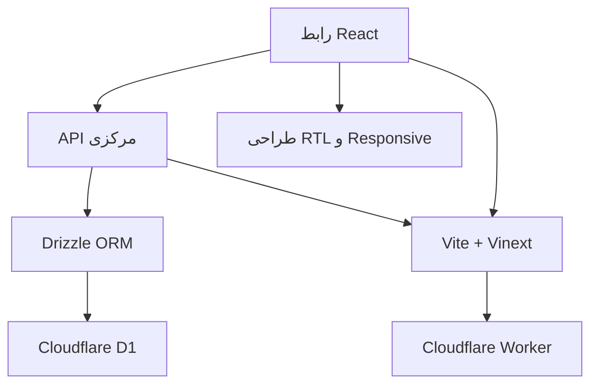

# راهنمای فایل‌ها و پوشه‌های Repo Time

این فایل توضیح می‌دهد هر بخش برای چه ساخته شده، کدام فایل را برنامه‌نویس ویرایش می‌کند، کدام فایل از Starter آمده و کدام فایل خودکار تولید می‌شود.

## نقشه کلی

## فایل‌هایی که برای این پروژه نوشته یا ویرایش شده‌اند

| مسیر | سازنده | وظیفه | آیا باید دستی ویرایش شود؟ |
|---|---|---|---|
| `app/page.tsx` | برنامه‌نویس | نقطه ورود؛ خواندن نام کاربر و اجرای اپ | بله |
| `app/layout.tsx` | برنامه‌نویس | عنوان سایت، SEO، زبان فارسی و RTL | بله |
| `app/globals.css` | برنامه‌نویس | تمام طراحی گرافیکی، رنگ‌ها، کارت‌ها، Modal و Responsive | بله |
| `app/api/workspace/route.ts` | برنامه‌نویس | خواندن و نوشتن مشتری، خدمت، نوبت و پیام | بله |
| `components/repo-time-app.tsx` | برنامه‌نویس | همه صفحه‌ها، فرم‌ها، Navigation و تعاملات | بله |
| `components/app-icon.tsx` | برنامه‌نویس | آیکن‌های SVG داخلی و بدون وابستگی خارجی | بله |
| `lib/types.ts` | برنامه‌نویس | قرارداد TypeScript همه داده‌ها | بله |
| `lib/demo-data.ts` | برنامه‌نویس | داده اولیه و حالت نمایشی/آفلاین | بله |
| `db/schema.ts` | برنامه‌نویس | تعریف پنج جدول D1 و ایندکس‌های آن‌ها | بله |
| `db/index.ts` | برنامه‌نویس + Starter | اتصال امن Worker به D1 | فقط با آگاهی |
| `public/favicon.svg` | برنامه‌نویس | نشان گرادیانی Repo Time در تب مرورگر | بله |
| `tests/rendered-html.test.mjs` | برنامه‌نویس | تست برند، Worker، Binding و Migration در Artifact | بله |
| `README.md` | برنامه‌نویس | معرفی، فناوری‌ها و روش اجرا | بله |
| `docs/*.md` | برنامه‌نویس | مستندات آموزشی و Roadmap | بله |

## فایل‌های تنظیمات واردشده از Starter

این فایل‌ها در زمان ساخت اولیه پروژه آمده‌اند. «واردشده» یعنی کپی از کد محصول مرجع نیستند؛ زیرساخت عمومی Build و Hosting هستند.

| مسیر | نقش |
|---|---|
| `worker/index.ts` | درخواست Cloudflare را به Vinext می‌دهد و بهینه‌سازی تصویر را مدیریت می‌کند |
| `vite.config.ts` | Pluginهای Vinext، Sites و Cloudflare را کنار هم قرار می‌دهد |
| `next.config.ts` | تنظیمات سازگاری Next/Vinext |
| `build/sites-vite-plugin.ts` | خروجی Build را به فرم مورد انتظار میزبان تبدیل می‌کند |
| `scripts/build-verified.sh` | Build را با محدودیت زمانی امن اجرا می‌کند |
| `scripts/install-ci.sh` | نصب وابستگی در محیط CI را کنترل می‌کند |
| `scripts/sites-env.sh` | مسیر Cache و Home موقت Build را تنظیم می‌کند |
| `app/chatgpt-auth.ts` | Helper اختیاری ورود با ChatGPT؛ فعلاً مستقیماً استفاده نشده |
| `examples/d1/` | مثال آموزشی Starter؛ بخشی از منطق واقعی Repo Time نیست |

## فایل‌های JSON که کامنت نمی‌پذیرند

استاندارد JSON اجازه `//` یا `/* */` نمی‌دهد؛ اضافه کردن کامنت باعث خراب شدن Build می‌شود.

| مسیر | کاربرد |
|---|---|
| `package.json` | نام پروژه، دستورها و فهرست وابستگی‌ها |
| `package-lock.json` | نسخه دقیق تمام Packageها؛ خودکار توسط npm |
| `tsconfig.json` | قوانین TypeScript و Alias مسیرها |
| `.openai/hosting.json` | شناسه Site و نام Binding پایگاه‌داده D1 |
| `drizzle/meta/*.json` | Snapshot خودکار ساختار جدول‌ها |

## فایل‌های تولیدشده که نباید ویرایش شوند

| پوشه/فایل | چه زمانی ساخته می‌شود؟ | محتوا |
|---|---|---|
| `node_modules/` | بعد از `npm install` | کد Packageهای نصب‌شده |
| `dist/` | بعد از `npm run build` | خروجی نهایی Worker، فایل‌های Client و Hosting manifest |
| `.next/` | هنگام Build/Dev | Cache و فایل‌های میانی Next |
| `.wrangler/` | هنگام Dev محلی | وضعیت و Logهای Cloudflare محلی |
| `.sites-runtime/` | هنگام آماده‌سازی Site | Cache و تنظیمات موقت محیط Build |
| `drizzle/meta/` | بعد از `npm run db:generate` | Snapshot قابل مقایسه Schema |

## داخل `dist/` چه می‌بینیم؟

- `dist/server/index.js`: Worker اصلی که درخواست HTTP را می‌گیرد.
- `dist/client/`: JavaScript و CSS بهینه‌شده‌ای که مرورگر دانلود می‌کند.
- `dist/.openai/hosting.json`: نسخه‌ی Build‌شده تنظیمات Hosting.
- `dist/.openai/drizzle/`: Migrationهایی که میزبان روی D1 اعمال می‌کند.

`dist` مثل فایل خروجی نصب یک برنامه است: از روی سورس ساخته می‌شود و منبع اصلی ویرایش نیست.

## مسیر یک ثبت نوبت

1. کاربر دکمه «ثبت نوبت» را در `repo-time-app.tsx` لمس می‌کند.
2. `AppointmentForm` اطلاعات مشتری، خدمت، تاریخ و ساعت را می‌گیرد.
3. `performAction` درخواست POST را به `/api/workspace` می‌فرستد.
4. API ورودی را بررسی و با Drizzle در جدول `appointments` ثبت می‌کند.
5. API Workspace تازه را برمی‌گرداند.
6. React بدون Refresh، تقویم و آمار را به‌روز می‌کند.

## سیاست کامنت‌گذاری

- بالای هر فایل دست‌نویس، هدف کل فایل توضیح داده شده است.
- بالای Hook، تابع، State، API Action و بخش گرافیکی مهم، کامنت فارسی قرار دارد.
- Propertyهای CSS در بخش‌های موضوعی توضیح داده شده‌اند.
- فایل‌های ماشینی/JSON دستکاری نشده‌اند تا استاندارد و Build سالم بماند.
